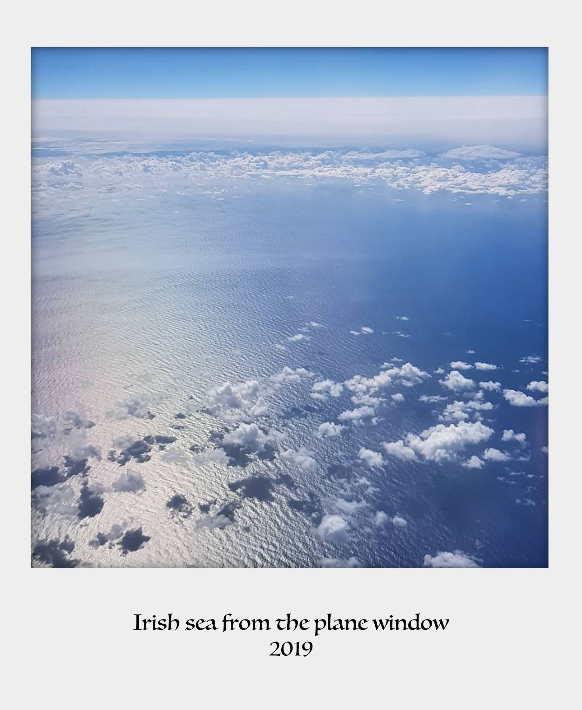

### **Profile**

------

Living in Dublin since 2019, I was born in the heart of Brazil. My professional journey started in my home country in Linguistics and Literature University. After studying it for a year I then transferred to Graphic Design. After graduation, I moved to Sao Paulo, the biggest city in Latin America, where I worked as a graphic designer for a few of years. 
I then got hired by public service and started working with politics. That was when my duties expanded to social media manager and IT support. This experience gave me the opportunity to discover my enthusiasm for computing and system administration. But in 2018, Brazilian's politics scenario got really bad. It was then that I took a chance and moved to Ireland, where it quickly felt like home despite the weather, to my own surprise I must admit. In 2020, I began a Higher Diploma in Science Computing in Dublin. Having just graduated I am now even more fascinated by this field, where I can see a bright future.

